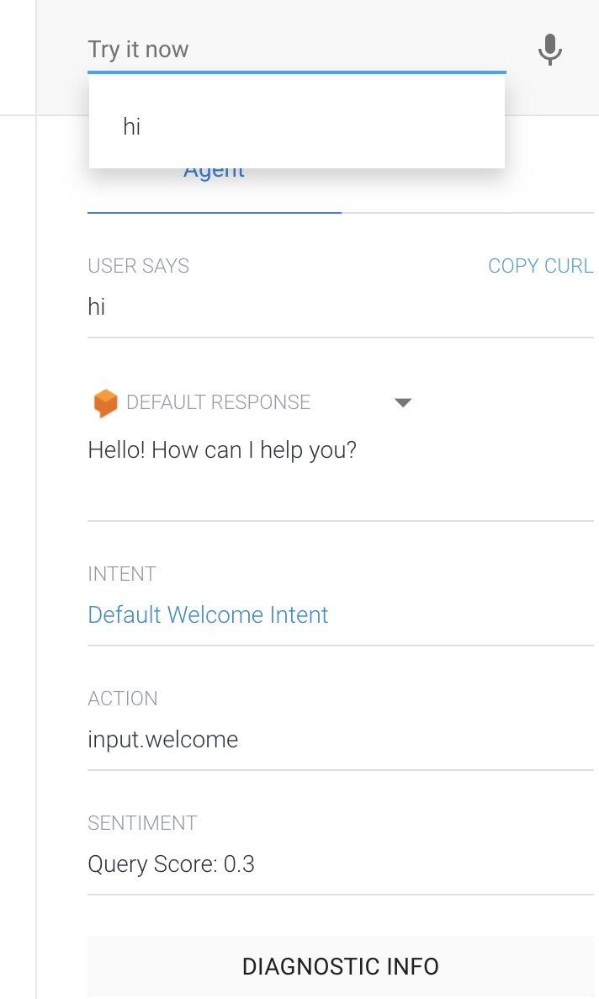

### Today were going to walk through the steps to getting set up with the Alexa Skills Kit Command Line Interface, or ASK CLI.

### Prerequisites: Please ensure you have Node.js, and Git installed. You will also need to set up free tier AWS and Amazon developer accounts, which can be found below.

[Get Started with Node.js](https://nodejs.org/en/)

[Get Started with Git](https://git-scm.com/downloads)

[Create an AWS FREE TIER account.](https://aws.amazon.com/) Card details will be required, but there is a free tier.

[Create an Amazon Developer account.](https://developer.amazon.com/)

To begin, open a new terminal instance, and run the commands below to ensure you have versions of both Git, and Node.js downloaded locally.

```
node --version
git --version
```

If they are both installed, and you have both an AWS account and an Amazon Developer account set up, run the command within your terminal

```
npm install -g ask-cli
```

If this command returns an error, and you are working on a mac, try running

```
sudo npm install ask-cli
```

Now, you will need to navigate to the IAM account setup section of the developer.amazon.com documentation. This can be found [here](https://developer.amazon.com/en-US/docs/alexa/smapi/manage-credentials-with-ask-cli.html#create-aws-credentials), alternatively copy the code below.

```
\{
  "Version": "2012-10-17",
  "Statement": \{
    "Effect": "Allow",
    "Action": [
      "iam:CreateRole",
      "iam:GetRole",
      "iam:AttachRolePolicy",
      "iam:PassRole",
      "lambda:AddPermission",
      "lambda:CreateFunction",
      "lambda:GetFunction",
      "lambda:UpdateFunctionCode",
      "lambda:UpdateFunctionConfiguration",
      "lambda:ListFunctions",
      "logs:FilterLogEvents",
      "logs:getLogEvents",
      "logs:describeLogStreams"
    ],
    "Resource": "*"
  }
}
```

Now, navigate to console.aws.amazon.com, click on the All Servives tab, and under Security, Identity, & Compliance, select the option IAM. This will open the IAM dashboard. From the left sidebar menu, under Access Management, select policies, and then select create policy.

Paste the JSON copied previously inside the JSON tab, removing all previous code. 


Click Next. Fill in the details as you see fit. Click create policy.

Now, from the left sidebar menu, select users, and then create user. Fill out the details, select Access key - Programmatic access as well as Password - AWS Management Console access, choose the password and login settings you desire, and click next, permissions.


Select attach existing policy directly, find your newly created policy and select it.


Click next, tags, add if desired, otherwise review, and click create user. Copy your secret key and save it in a secret location, and make note of your access key ID as well.


Now, navigate to your terminal one again and run the command

```
ask configure
```

Select default user, and log in via the browser. Return to terminal once logged in and type y to link your aws accounts, select existing profile.


Navigate to your directory of choice and run 

```
ask new
```

Select Node.js, AWS Lambda, Hello World, and name your skill and the containing folder. Now, run the commands

```
cd project-name
ask deploy
```

When you see the message "skill is enabled successfully" navigate to developer.amazon.com and click on the Alexa tab in the top left corner, go to the right top corner and open the drop down menu, select Alexa developer console. You should see your newly created skill at this location.


Now, navigate to aws.amazon.com, and sign in to the console. Select Lambda from the list of services. Once the lambda console opens, ensure your location is set to the default (US East (N. Virginia)us-east-1), and you should see your newly deployed Lambda function!

