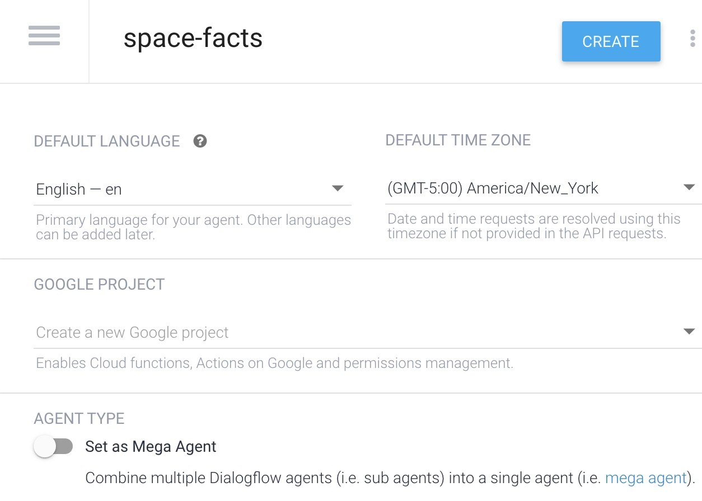
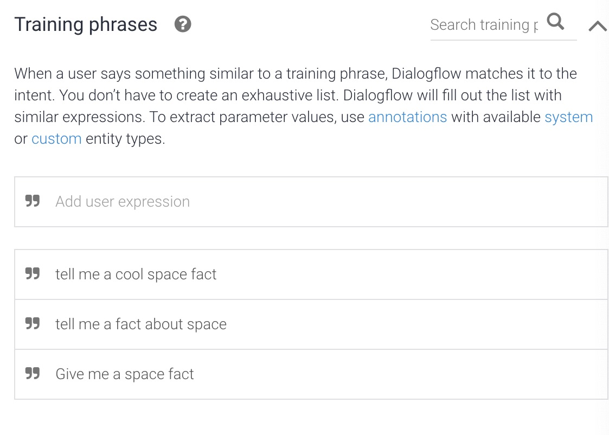
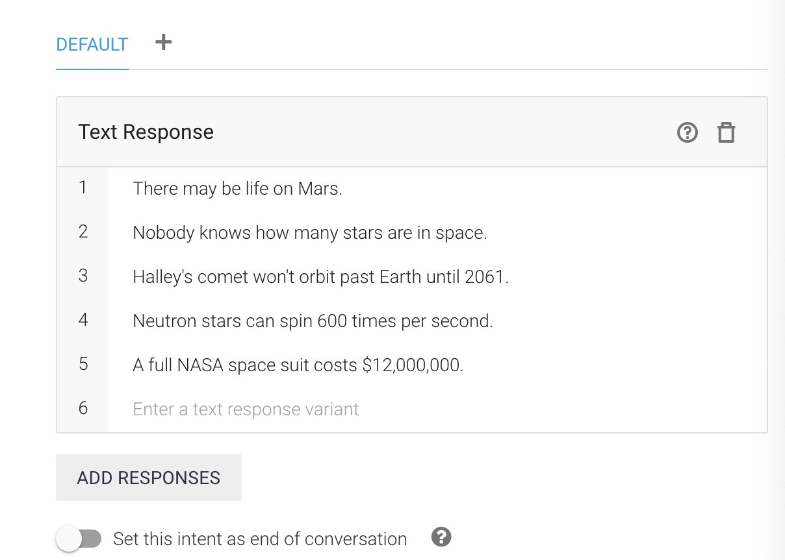
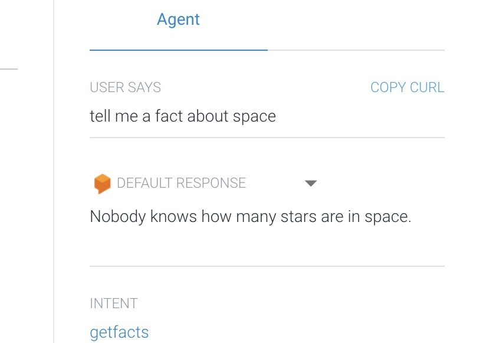

Today were going to walk through the steps to create a Google Assistant action using Dialogflow.

Prerequisites: Please ensure you have an account on Dialogflow, a link to get started can be found below.

[Get Started with Dialogflow](https://dialogflow.cloud.google.com/#/login)

After creating a new account within the Dialogflow console, navigate to dialogflow.cloud.google.com. From the left sidebar menu, select create new agent. Give your new agent a name, select a time zone, and click create.

 

Now, on the intents section of the console, click create new intent. And fill in a few training phrases.

Now scroll down and select Execute and respond to the user, and fill in a few responses, and save.

Head to the right sidebar to test, type in or say one of your input training phrases or some variation of one of them into the input, press enter, and see one of your input responses!

