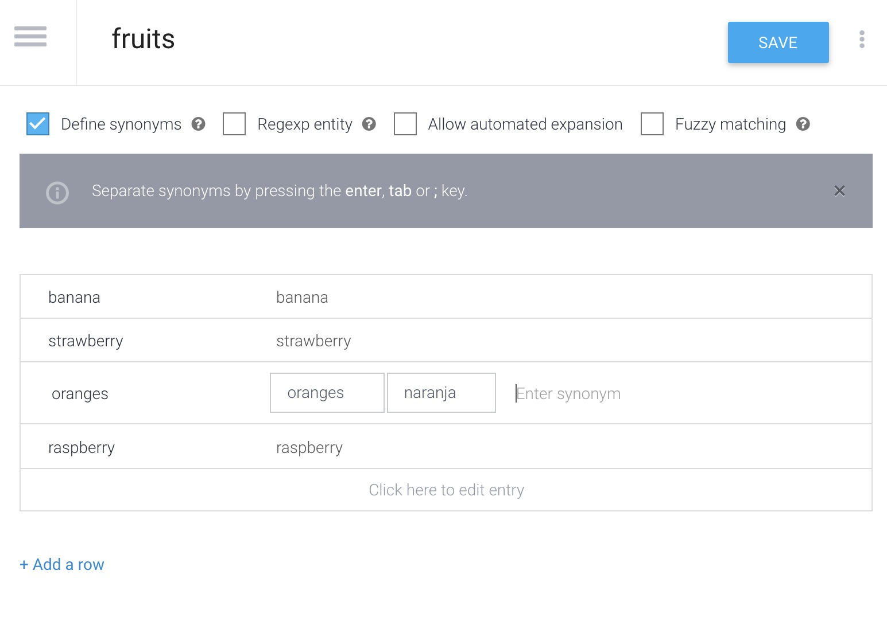

Today were going to walk through Dialogflow intents, and how to use or create our own system entities within an intent.

Prerequisites: Please ensure you create a Dialogflow account.

[Get Started with Dialogflow](https://www.dialogflow.cloud.google.com)

After creating a Dialogflow account, navigate to the console. On the right sidebar menu, select create agent. Give your new agent a name, and ensure your time zone and language settings are correct, then click create.

 

You should now be brought to a page with your agent's intents. By default Dialogflow creates a greeting, and a fallback intent for each new agent. The default greeting says hello or sends a greeting when a user says some variation of the word "hello." The default fallback intent lets the user know their input text or audio is unknown to the bot, and responds with a message saying so.

Now, click on the button to create intent, name your new intent book flights. Under training phrases, add a few expressions, such as "book a flight", "book a flight for me", "book a flight on Monday at 3pm." Notice how Monday and 3pm are highlighted by dialogflow, and given a parameter called date-time. These built in parameters are prebuilt entities provided by Dialogflow and are called system entities. 

Click save, then scroll down to the Responses area. Add in a new, dummy response for this intent that says "Got it, I will book the tickets for you" And save!

Within the right sidebar, test your new intent by typing in the phrase "Book a flight for me on Tuesday morning." Notice how the input date/time are registered automatically under the date-time parameter, and your pre-defined default response is returned.

Now, we're going to create our own custom developer entity.

Return to your console, and create a new intent. Call this intent favorite fruit, and enter the training phrase, "My favorite fruit is banana," and save! Now, double click on the word banana, and see Dialogflow's suggested prebuilt entities to associate with the word, select create new.

Name your new entity fruits, and input values for strawberry, oranges, raspberry. Creating this fruits entity will ensure the training model recognizes values that are input and percieve if they are fruits. You can also add synonyms to your entity listed terms to ensure other terminologies for the same word will be percieved and treated the same as the original term. Save, and click done.

Now return to intents, and open your favorite fruit intent. Add a default response that says "Thats a good choice, eating fruit is healthy!" Save, and in the right sidebar, test this intent by typing some variation of "my favorite fruit is banana" and pressing enter. See the system entity be registered by the model and reply with the response we defined in our favorite fruit intent.

Now, within your favorite fruit intent, on your input training phrase that says "my favorite fruit is banana" double click on the word banana, and from the list of entities, select fruits.

Scroll down to the actions and parameters section, and check the box in the fruit entity row called "is list," and save.

Now, in the right sidebar, test this by typing some variation of the phrase "my favorite fruits are strawberry and orange." Watch how the fruits are added as an array under the fruits parameter.

We have successfully learned about intents, the default hello intent, the default fallback intent, how to create our own intent, and how to add your own system defined entities.