Today were going to walk through the steps to create a new Fulfillment within Dialogflow using the free option, webhooks.


Prerequisites

Please ensure you have both Node.js installed, as well as Postman. You can find download links at the following locations.

- [Get Started with Node.js](https://nodejs.org/en/)
- [Get Started with Postman](https://www.postman.com/downloads/)

To begin, open a new terminal instance at the directory location of your choosing, create new diretory that will contain your project, and cd into it.

```
mkdir dialogflow-tutorial
cd dialogflow-tutorial
```

You will now need to initialize a new npm project within your directory, run the command below and fill in the required information as you see fit.

```
npm init
```

Then, install the npm packages express, firebase-functions, and dialogflow-fulfillment. Create a new index.js file to act as the main page of your project, and open your project in the text editor of your choice.

```
npm install --save express firebase-functions dialogflow-fulfillment actions-on-google ngrok
touch index.js
```

Now, navigate to your package.json file, within the "scripts" area, add a start script

```
"start": "node index.js",
```

Now, navigate to your index.js file and add the following lines of code to create a new express server instance.

```
const express = require('express');
const \{WebhookClient} = require('dialogflow-fulfillment');
const app = express();
const port = process.env.PORT || 3000

app.use(express.urlencoded(\{extended: true})); 
app.use(express.json());


app.post('/dialogflow-fulfillment', (request, response) => \{
console.log("test")
})

app.listen(port, () => \{
    console.log(`listening on port ${port}`)
})
```


Test your new server instance by running the command below, and navigating to your Postman application.

```
npm start
```

Enter the follwing information into Postman and press send to activate a POST request.

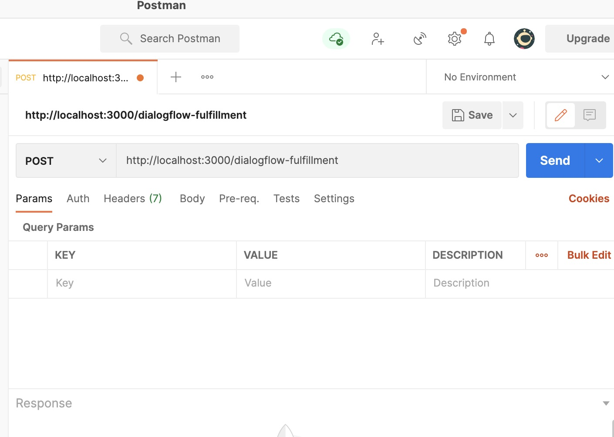 

You should see the following output within your terminal, this means your server is functioning correctly.

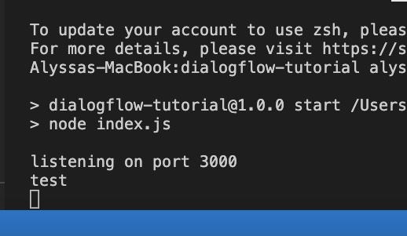 

Now, navigate to your index.js file and add in a function to define your fulfillment. Create a new agent using a WebhookClient instance, and add a function to define your desired action. 

```javascript
const dialogflowFulfillment = (request, response ) => \{
    const agent = new WebhookClient(\{ request, response })

    function sayHello(agent) \{
        agent.add("Hi there, this response is coming from Heroku")
    }

    let intentMap = new Map();
    intentMap.set("Default Welcome Intent", sayHello)
    agent.handleRequest(intentMap)
}
```

Now, return to your /dialogflow-fulfillment endpoint, remove the console.log code, and pass in your dialogflowFulfillment function.


```
app.post('/dialogflow-fulfillment', (request, response) => \{
dialogflowFulfillment(request, response)
})
```

Navigate to your dialogflow console, click on intents. Select the intent call "Default Welcome Intent".

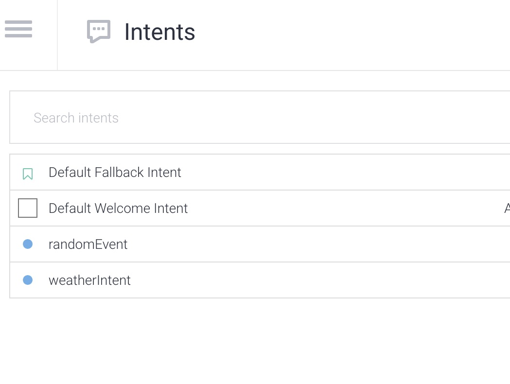 

Now, scroll down and open the fulfillments section, select Enable webhook call for this intent.

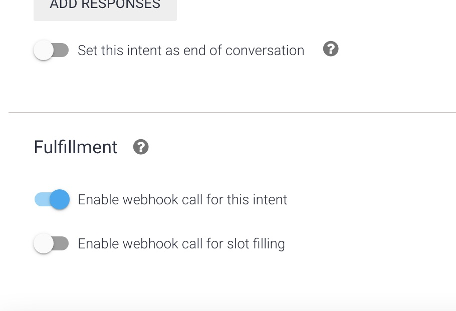 

Use the sidebar on the right to type Hi, and press enter, then select Diagnostic info.

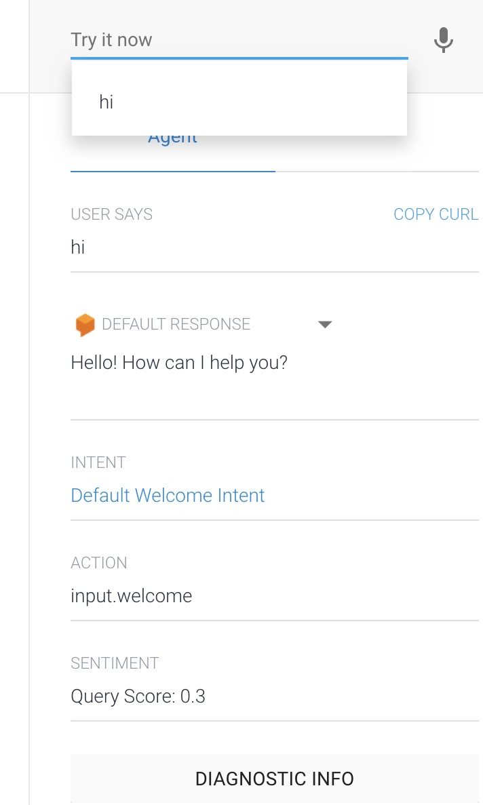 


Click the Fulfillment request tab and copy raw response.

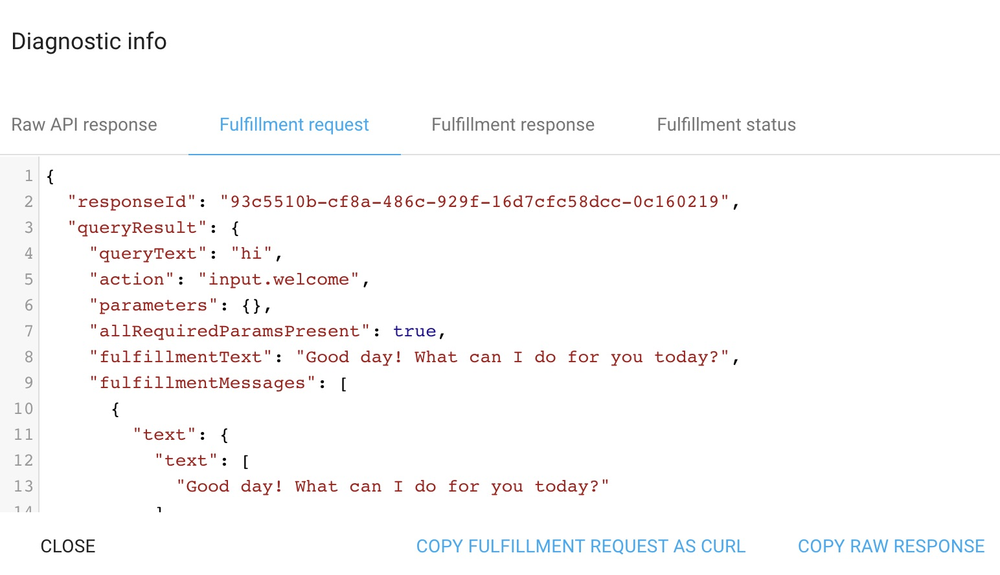 

Navigate to Postman, go to the body tab, select raw and JSON and pase the fulfillment request into it. Press send and see your pre-defined response.

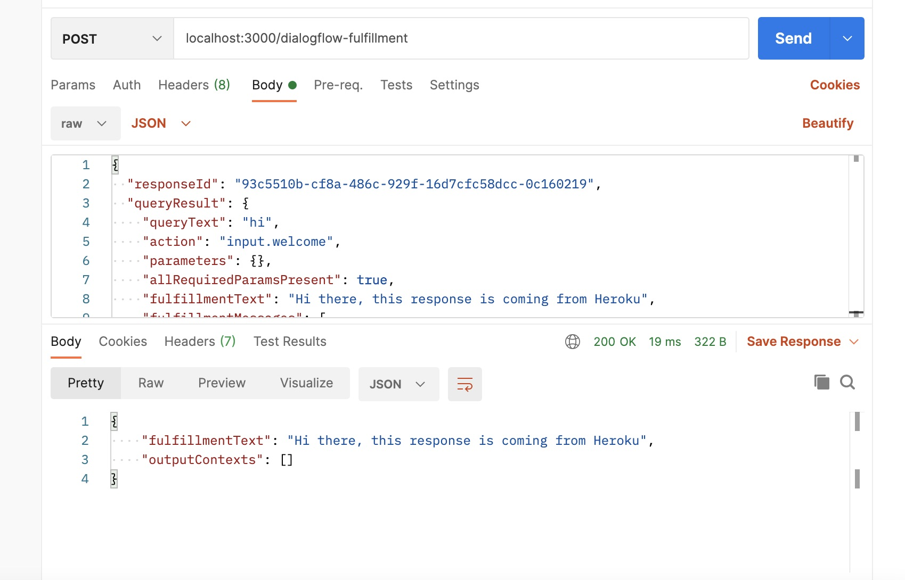 

Now, return to your terminal and run ngrok 3000, copy the https forwarding address.

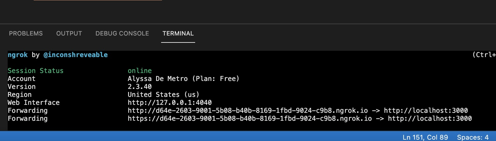 


Return to Postman and replace your localhost URL with your copied ngrok one, and hit send. You should recieve your pre-defined output just as before.

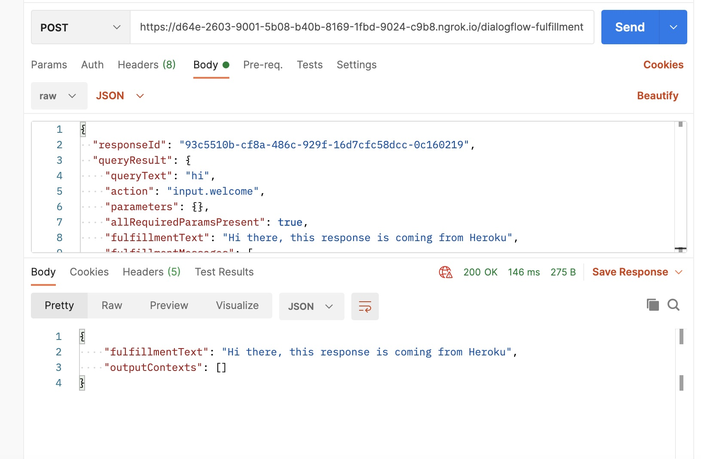 

Now, copy the full url from Postman with the /dialogflow-fulfillment endpoint added to it and navigate to the fulfillment tab within Dialogflow. Enable webhook fulfillment, paste your ngrok URL and save.

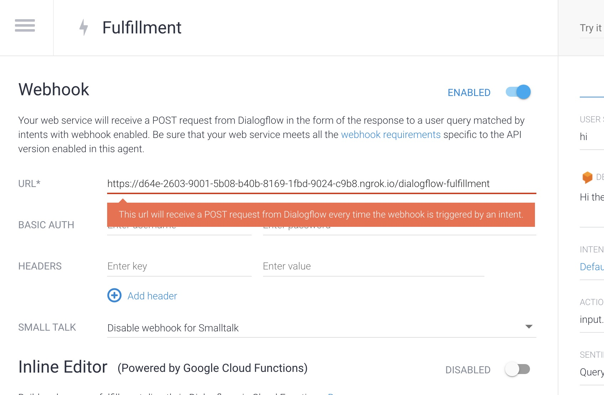 

Now, try typing hi into the right sidebar once again, and see Dialogflow return your desired output!

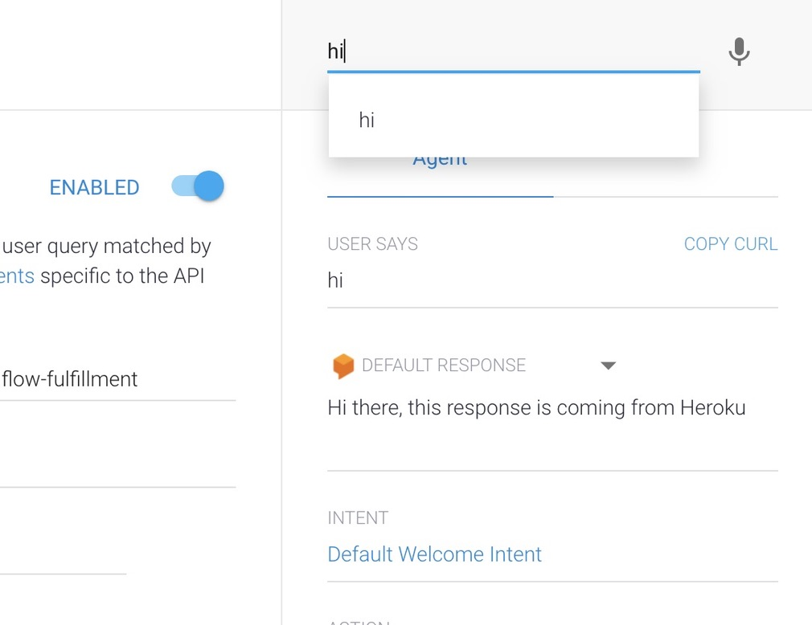 