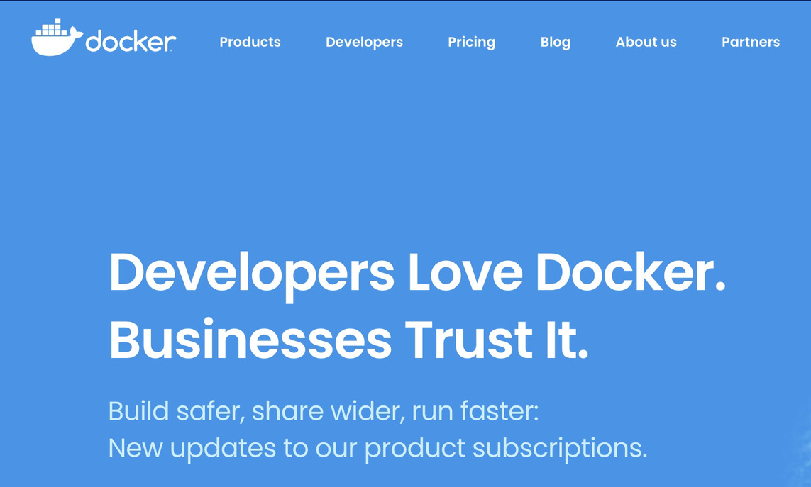
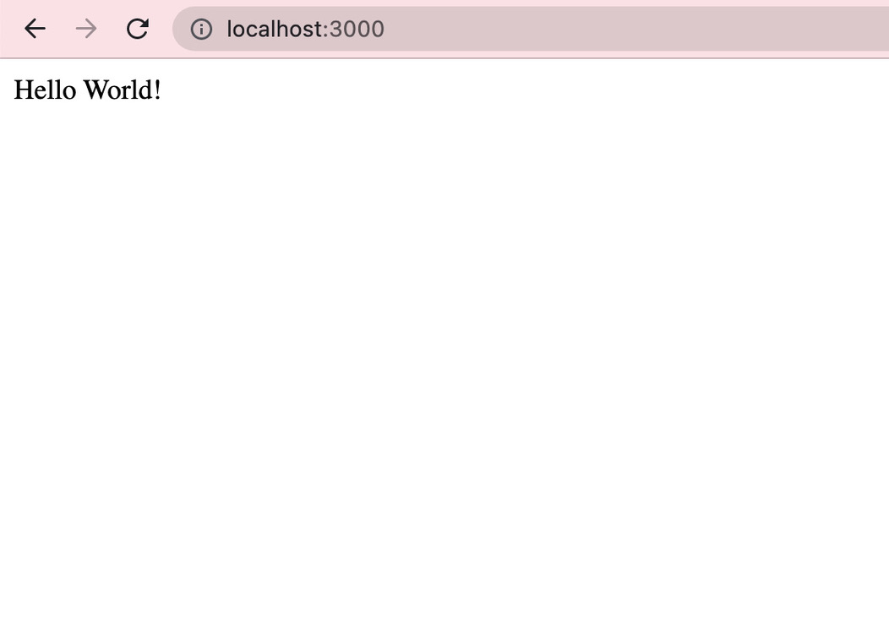
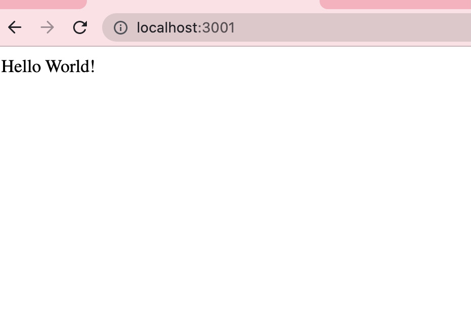

# Docker with Node.js in 5-minutes

### Today were going to walk through the steps to create a new Docker image via a Node.js application.

Prerequisites: Please ensure you have both Node.js installed, as well as Docker. You can find download links at the following locations.

- [Get Started with Node.js](https://nodejs.org/en/)
- [Get Started with Docker](https://www.docker.com/get-started)

To begin, open a new terminal instance at the directory location of your choosing, create new diretory that will contain your project, and cd into it.

```ssh
mkdir docker-tutorial
cd docker-tutorial
```

You will now need to initialize a new npm project within your directory, run the command below and fill in the required information as you see fit.

```ssh
npm init
```

Then, install the npm package express, create a new index.js file to act as the main page of your project, and open your project in the text editor of your choice.

```ssh
npm install --save express
touch index.js
```

Now, add the following lines of code to your newly created index.js file to create a new express server instance.

```javascript
var express = require("express");
var app = express();
app.get('/', function (req, res) {
    res.send('Hello World!')
})
app.listen(3000, function() {
    console.log('app listening on port 3000');
})
```

Test your new server instance by running the command below, and navigating to [localhost:300](http://localhost:3000)

```ssh
node index.js
```

You should see the following output.



In order to find which version of Node your local system is using, run the command 

```ssh
node -v
```

Now, return to your terminal and run the lines below to create a new Dockerfile within your project's root directory, plug in the version of Node you wish to use.

```ssh
touch Dockerfile
```

Within your newly created Dockerfile, add the lines below, and be sure to update the node version.

```ssh
FROM node:14
WORKDIR /app
COPY package.json /app
RUN npm install
COPY . . 
CMD node index.js
EXPOSE 3001
```

Now, ensure your desktop Docker application is running, and you can build your new Docker image using the following lines, however, be sure to replace the project name with the name you have given to your project.

```ssh
docker build -t docker-tutorial .
```

Now run this process by using the following command

```ssh
docker run -p 3001:3000 docker-tutorial
```


Now, navigate to [localhost:300](http://localhost:3001/) and you should see your application's output once again.




