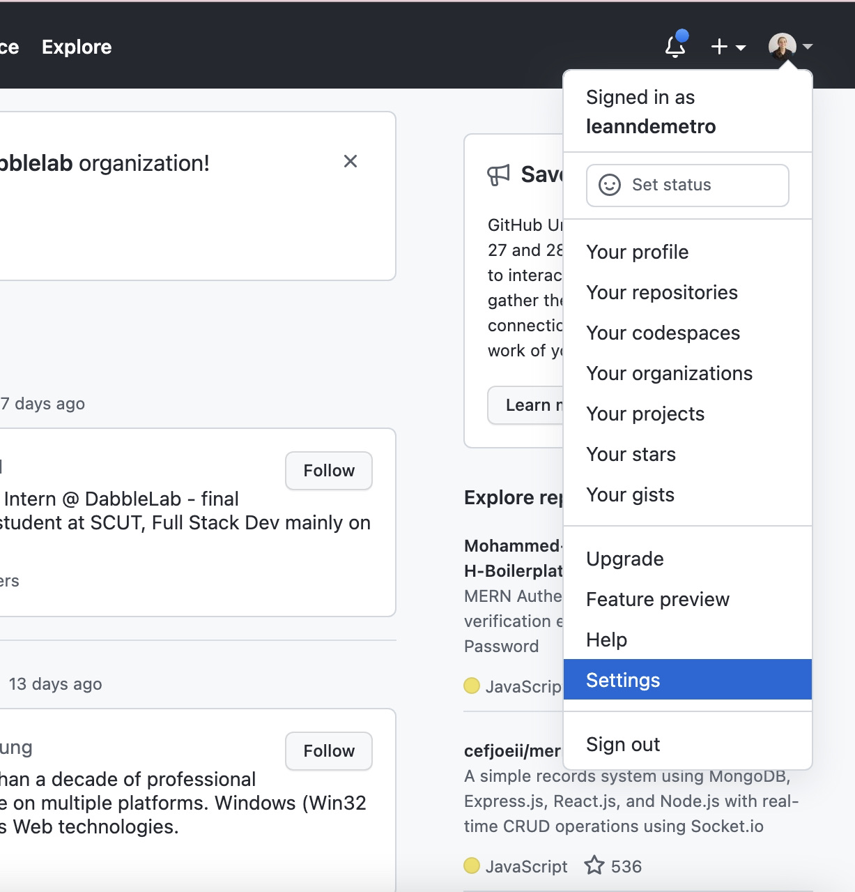
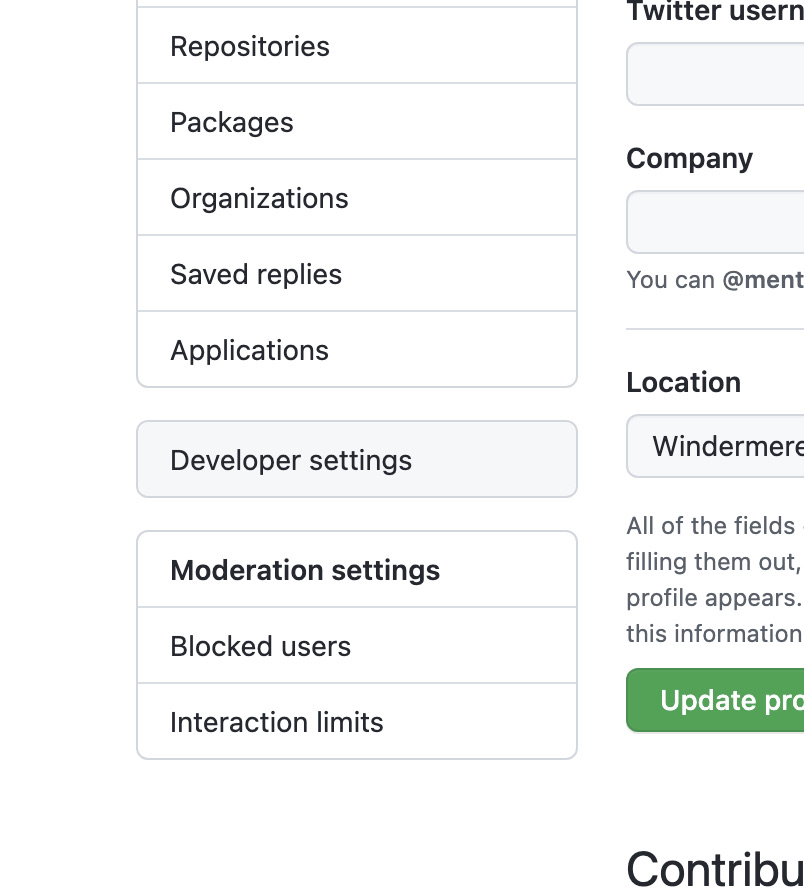
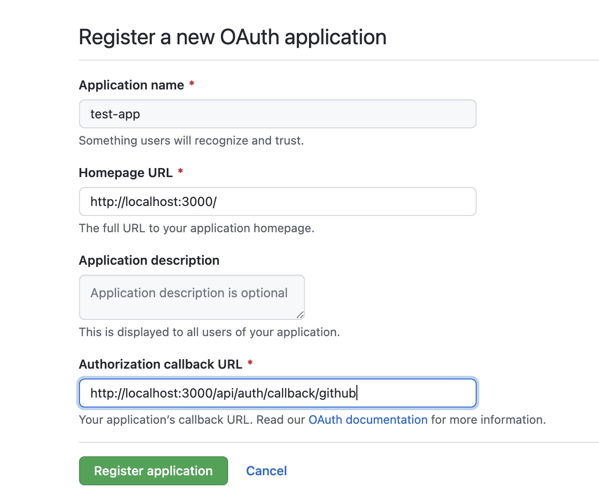
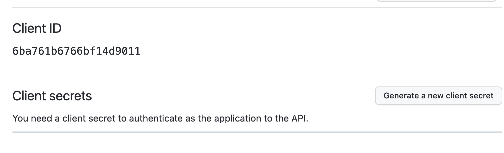

# Creating login functionality within a Next.js application using the NextAuth.js Github provider.

### Today were going to walk through the steps to create login functionality within a Next.js application using the Next-Auth.js Github provider.

For a more detailed walkthrough, please view my video tutorial [here](https://www.loom.com/share/017f055a149e4fe49f810af0c040de93)

The easiest way to get started is by cloning the Next-Auth-Example repository provided by Next-Auth.js located [here](https://github.com/nextauthjs/next-auth-example)


Once you have cloned the repository to your desired directory, open it within your preferred text editor, open the integrated terminal within your file's root directory, and run the code:

```ssh
npm install
```

From there, navigate to the env.local.example file, and remove the .example from the name, it should now be called .env.local

Then, remove all code within .env.local other than what is seen below:

```env
NEXTAUTH_URL=http://localhost:3000
SECRET= # Linux: `openssl rand -hex 32` or go to [gen-secret](https://generate-secret.now.sh/32)
GITHUB_ID=
GITHUB_SECRET=
```

To configure the environmental variables, 
1. Set the NEXTAUTH_URL to the deployed located of your application, for development it should be localhost.
2. Open the link that is currently within the SECRET value to dynamically generate a random code to be used as our secret, copy and replace the SECRET value with it, like so:

```env
SECRET=456ce5acdcec2819034320cf2d2221b2
```

Now, navigate to [Github](https://github.com/) and click on settings



Then, navigate to developer settings



From there, navigate to Oauth apps, and then select new Oauth app, fill out the form as follows, and register your application:



From the next page, copy the Client Id and paste it in as the value of GITHUB_ID, and generate a new Client Secret, copy and paste it as the value of GITHUB_SECRET



The values below are mock values, but this is an example of what your .env.local file should look like.

```env
NEXTAUTH_URL=http://localhost:3000
SECRET=03ed1b03ff7358d6be16c43d12024b14
GITHUB_ID=c765c182d27296b6a4a2
GITHUB_SECRET=34bbe0d222a01343eae70918b389e5dfba9134ab
```

Now, navigate to the pages/api/auth directory, and open the nextauth.js file. The purpose of this naming convention is to let Nextauth know that any routes pointing to /Auth should be directed to this component.

Delete all providers within this file other than the Github provider, remove the database url, and remove any redundant code or comments.

```javascript
  import NextAuth from "next-auth"
  import Providers from "next-auth/providers"
export default NextAuth({
    providers: [
      Providers.GitHub({
      clientId: process.env.GITHUB_ID,
      clientSecret: process.env.GITHUB_SECRET,
    }),
 ],
  secret: process.env.SECRET,
```

 Remove all redundant comments from session, and copy the session closing curly brace, delete it, and move it just below the line that says debug false so that all information will be contained within the session data.

 Under jwt, uncomment the secret line and set it equal to process.env.secret, write out a payload, and uncomment and write out encode and decode methods to create and verify jwt token.

  ```javascript
      secret = process.env.SECRET,
     encode: async ({ secret, token }) => {
        const jwtClaims = {
          "sub": token.id,
          "name": token.name,
          "email": token.email,
          "iat": Date.now() / 1000,
          "exp": Math.floor(Date.now() / 1000) + (24 * 60 * 60),
          "https://hasura.io/jwt/claims": {
            "x-hasura-allowed-roles": ["user"],
            "x-hasura-default-role": "user",
            "x-hasura-user-id": token.id,
          }}
       const encodedToken = jwt.sign(jwtClaims, secret, { algorithm: 'HS256' });
        return encodedToken;
      },
       decode: async ({ secret, token }) => {
        const decodedToken = jwt.verify(token, secret, { algorithms: ['HS256'] });
        return decodedToken;
      },
  ```

Delete all redudant comments from the pages section, delete the signin comment from within the callback section, and uncomment the rest.

Set up the redirect url to home, write out method to get session data returned from your jwt as a promise.

```javascript
async redirect(url, baseUrl) {
return "/"; },
async session(session) { 
const encodedToken = jwt.sign(token, process.env.SECRET, { algorithm: 'HS256' })
session.id = token.id;
session.token = encodedToken;
return Promise.resolve(session);
},
async jwt(token, user ) { 
const isUserSignedIn = user ? true : false;
if (isUserSignedIn) {
token.id = user.id;
}
return Promise.resolve(token);
}
 ```   

  Remove the rest of the redundant comments, set debug to true for more verbose error codes.

  ```json
  events: {},
  theme: 'light',
  debug: true,
  ```
    

   Open integrated terminal and:
    
    ```ssh
    npm install jsonwebtoken
    ```
    
    
  At the top of this file add:
  
  ```javascript
 import jwt from "jsonwebtoken"
  ```
    

  Now, within the integrated terminal run

  ```ssh
  npm run build
  npm run dev
  ```
  

  
  Let the page load, and log in!


  For a more detailed walkthrough, please view my video tutorial [here](https://www.loom.com/share/017f055a149e4fe49f810af0c040de93)
