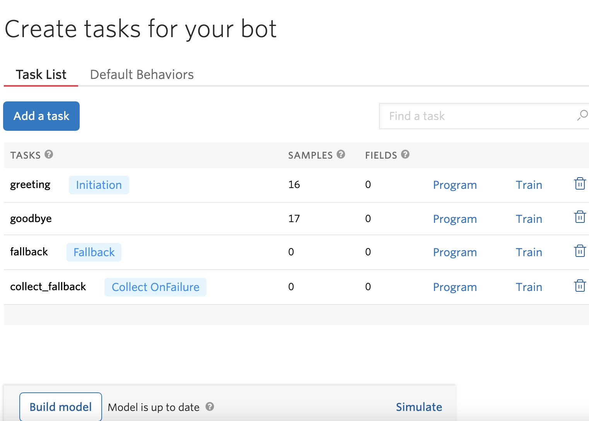
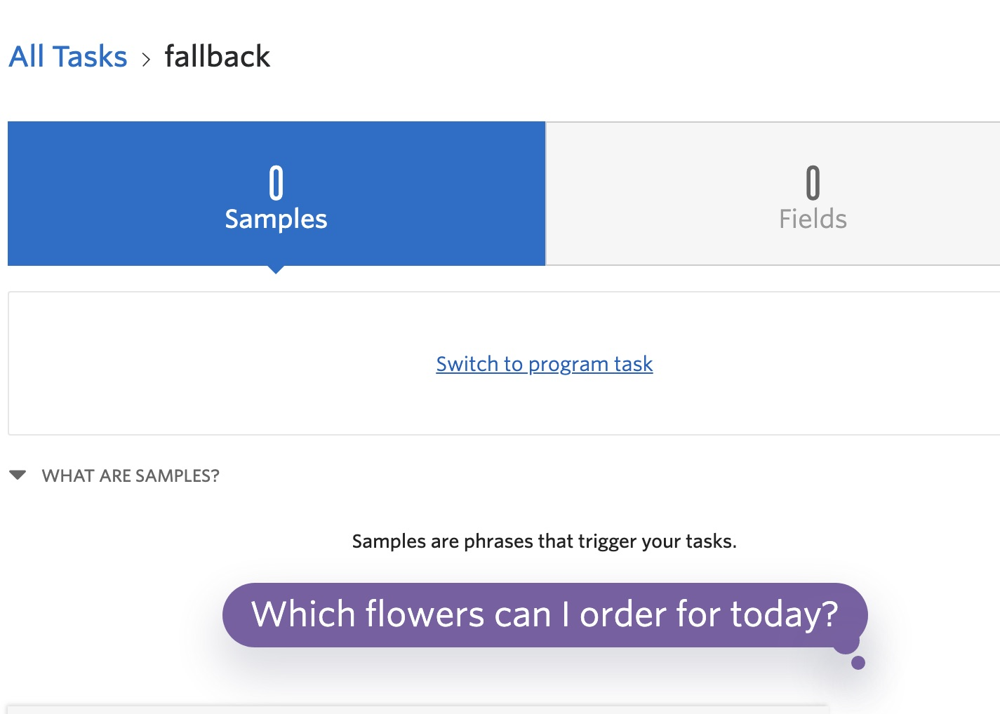
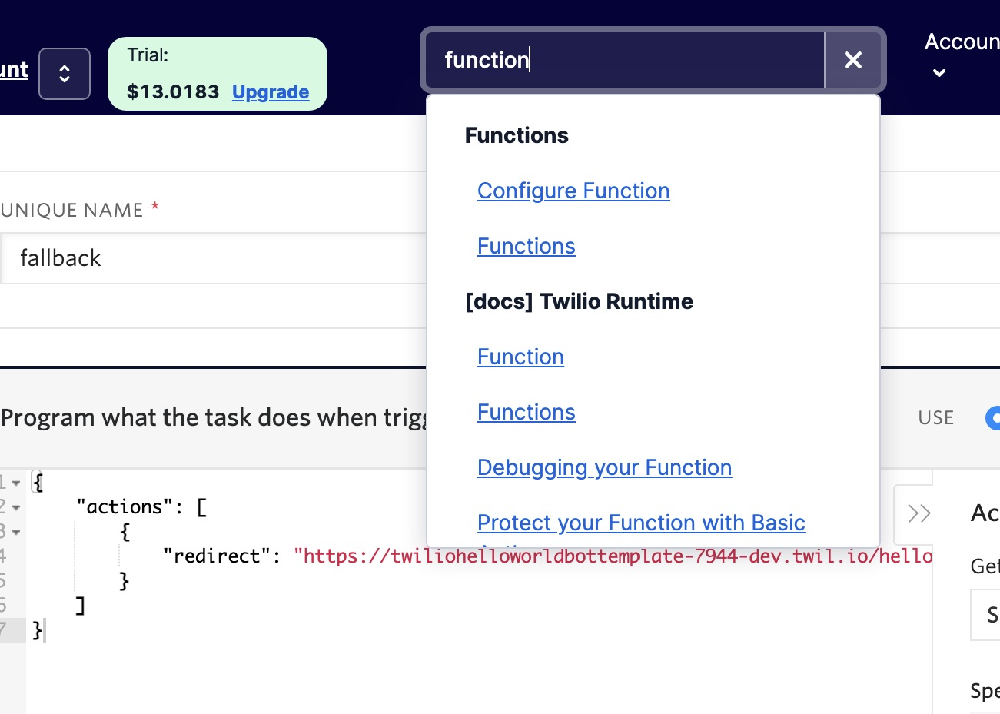
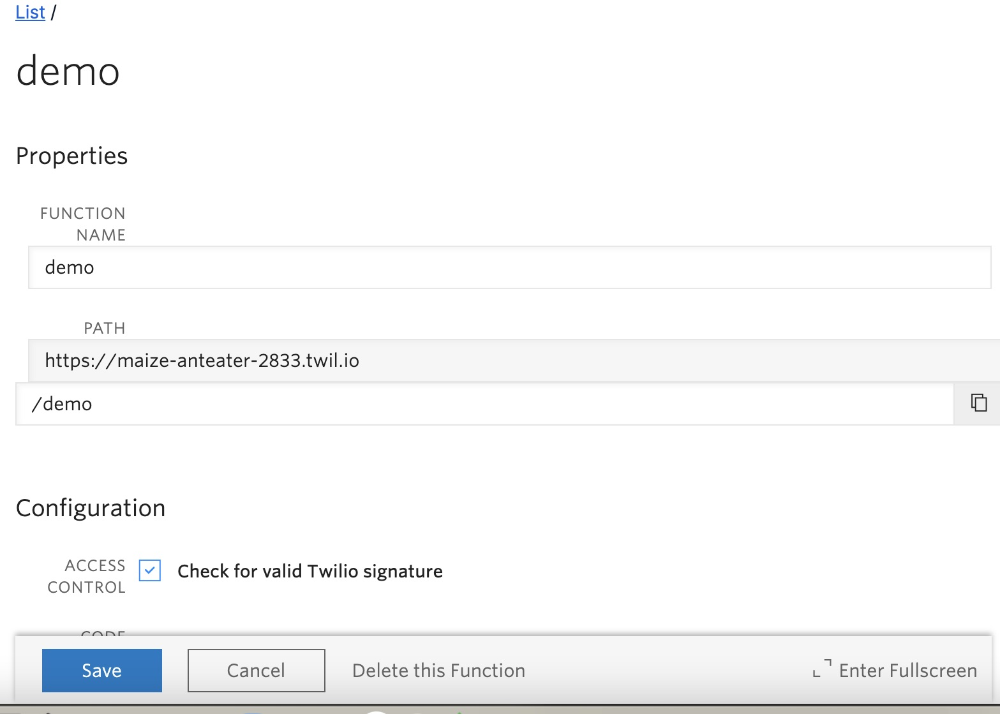
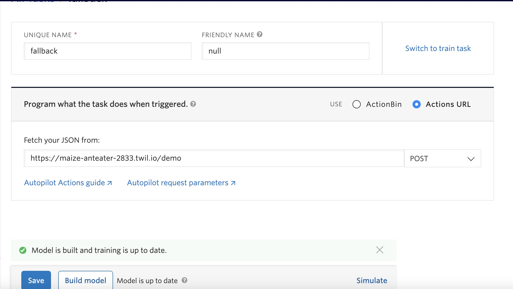
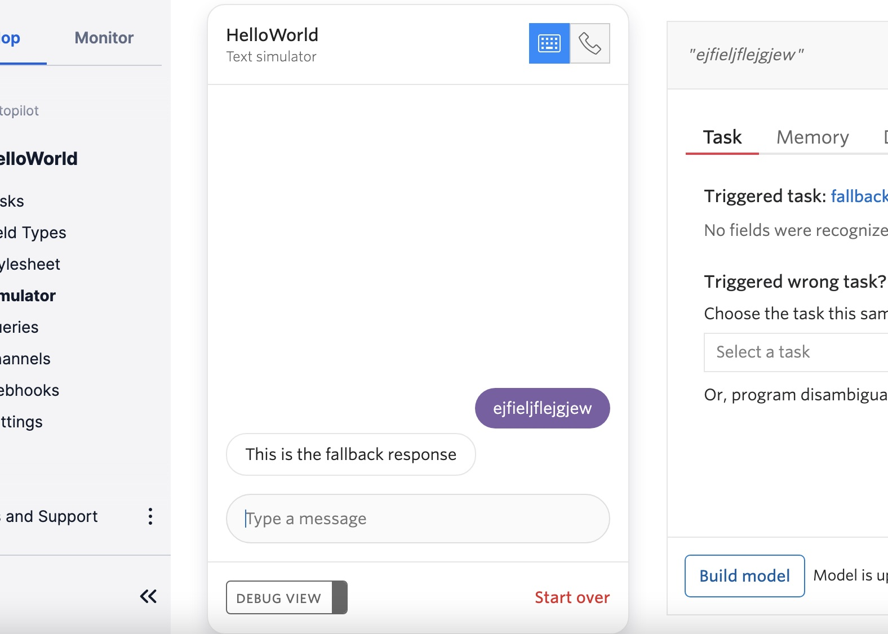
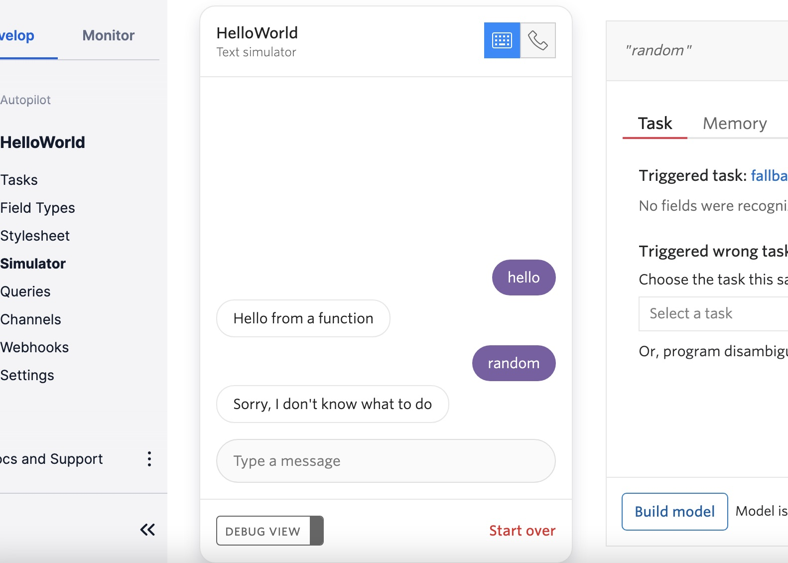

Today were going to learn to use Twilio functions in order to handle Autopilot tasks.

Prerequisites: Please ensure you create an account to use the Twilio console. You will also need to know how to create a basic Autopilot bot.

[Get Started with Twilio](https://www.twilio.com/try-twilio)

Create a new Hello World or Demo autopilot bot, navigate to your Twilio console. Click on explore products, then autopilot. Select your newly created bot.

 

From the list of tasks, go to fallback, click on train, and then select swtich to program task.

 

Now, open a new tab and open your twilio console. Type function into the search bar, and select functions.

 

From the left sidebar menu, under functions (classic), select Lists, and click the button to create a new function.

Give your function a name, and create an endpoint named the same.

 

Scroll down to the configuration inline editor, and enter the following code, and save.

```javascript
exports.handler = function(context, event, callback) {
	let response = {};
	response.actions = [];
	response.actions.push({"say" : "This is the fallback response"})
	callback(null, response);
};
```

Now, copy your function's URL with the created endpoint, and return to your Hello World fallback task. Select the Actions URL button, and paste your function URL. Save, build.

 


From the left sidebar menu, select simulator, and type in random text to trigger the fallback response, which should contain the message determined within the function you just created.

 

Now, navigate back to the function you created, and change your code to work for multiple cases.

```javascript
exports.handler = function(context, event, callback) {
	let response = {};
	response.actions = [];
	
	switch(event.CurrentTask) {
	    case "greeting" :
	        response.actions.push({"say" : "Hello from a function"});
	        break;
	    case "fallback" :
	        response.actions.push({"say" : "Sorry, I don't know what to do"});
	        break;
	}
	callback(null, response);
};
```

Head back to your Hello World tasks, and replace the greeting task's URL with your function's as we did in a previous step. Save, and build. Open the simulator once again, say Hello to test the greeting task, and input something random to trigger the fallback task, and watch the magic happen!

 
