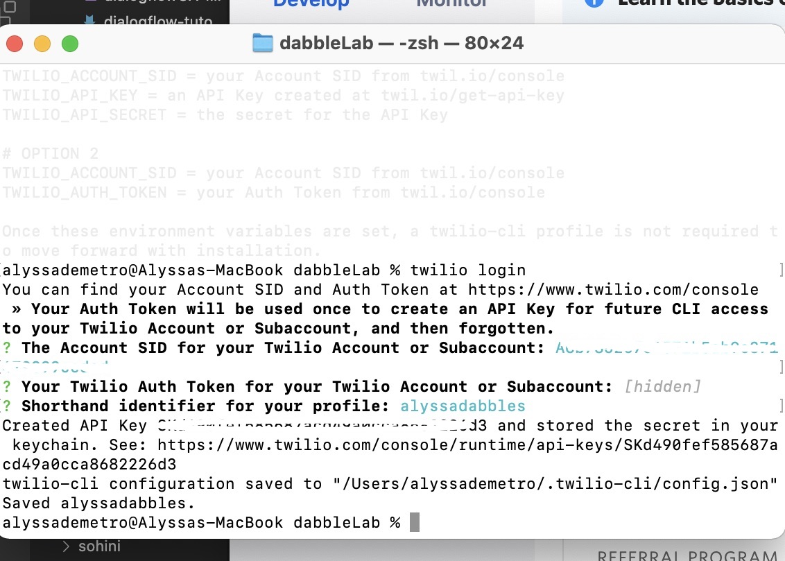
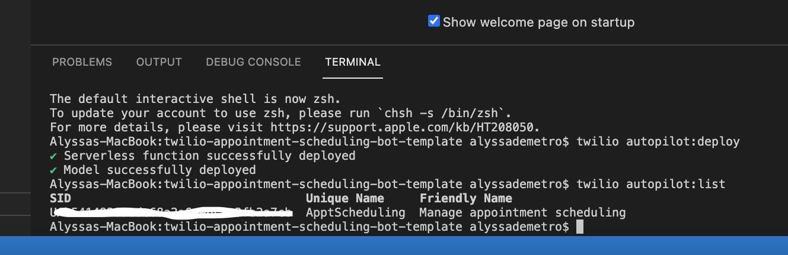
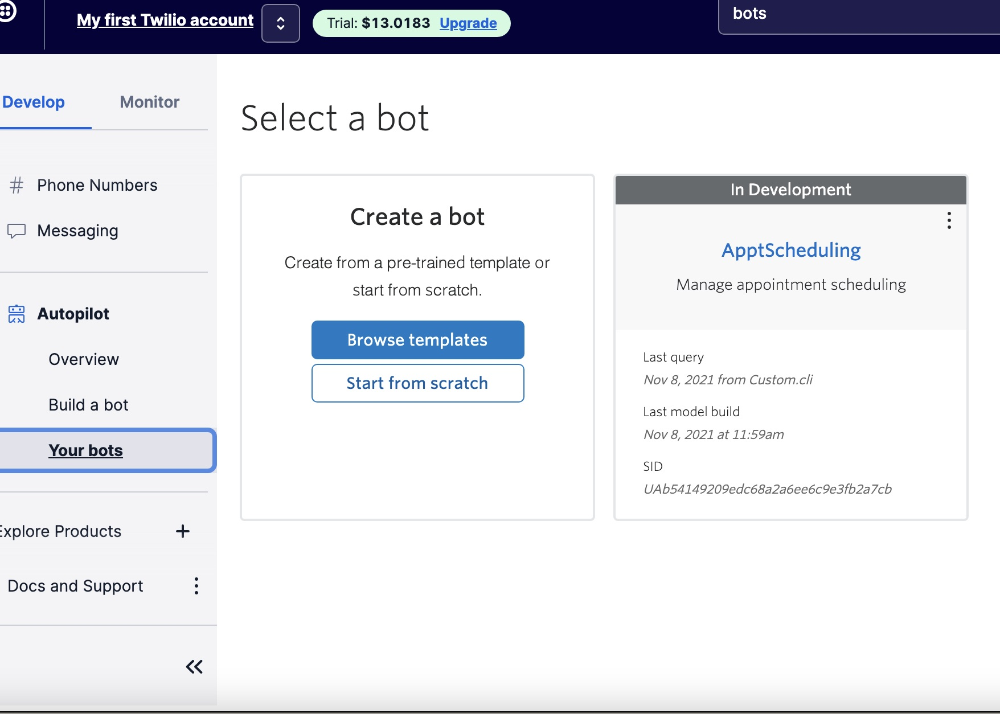
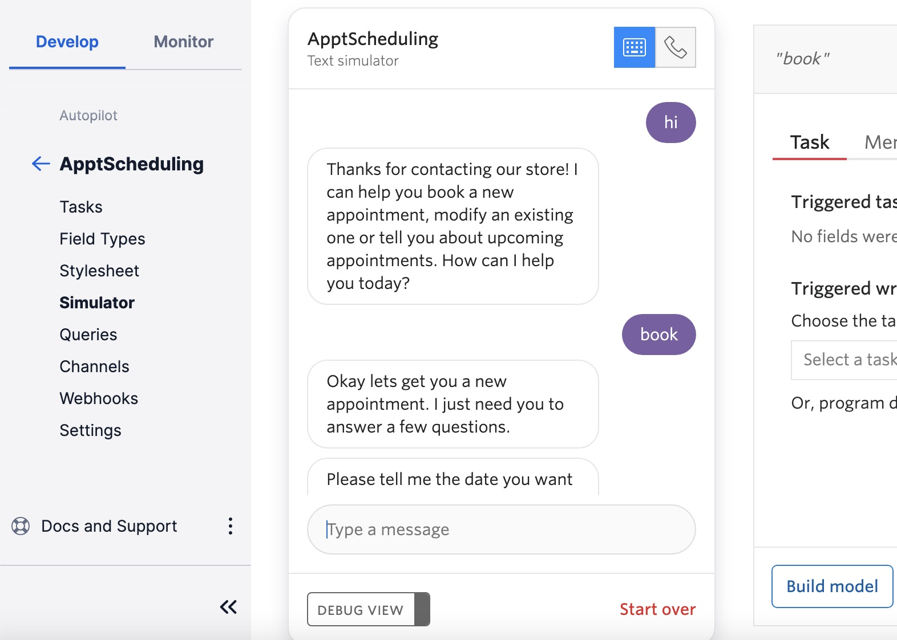

# Building AI Bots with Twilio Autopilot and the Twilio CLI

In this tutorial, we're going to walk through creating an AI Bot using Twilio autopilot, and the Twilio CLI.

## Prerequisites

To follow along, you'll need a Twilio account and optionally have either Homebrew or Node.js installed.

- [Get Started with Twilio](https://www.twilio.com/try-twilio)
- [Get Started with Homebrew](https://brew.sh/)
- [Get Started with Node.js](https://nodejs.org/en/)

After creating a new Twilio account, navigate to twilio.com/cli and follow the steps to install.

Once twilio is installed, enter the following command into your terminal.

```ssh
twilio login
```

Now navigate to twilio.com/console, and from the homepage, copy your account SID and paste it into your terminal, press enter. Now, copy your account auth token, paste into terminal, press enter. Now, add the shorthand identifier of your choosing.



Within your terminal, CD in your preferred directory, and create a new project using an autopilot template by running the command

```ssh
twilio autopilot:init
```

Select the appointment scheduling option from the list. Now open the newly created directory called twilio-appointment-scheduling-bot-template in the text editor of your choice. Open a terminal instance at your project's root directory and enter the command 

```ssh
twilio autopilot:deploy
```

Once this process successfully completes, run the command below to ensure your deployment has been successful.

```ssh
twilio autopilot:list
```

 

Now, within your terminal, copy your SID and run the command below to test your bot!

```ssh
twilio autopilot:simulate -s <SID> -t "hello"
```

You may also navigate to the twilio console once again, head back to the autopilot section, and from the left sidebar menu select "Your bots." You should see your ApptScheduling bot here.

)

Click on your ApptScheduling bot, then select Simulator from left sidebar menu. Type a simple "Hello" to see your bot in action!

 

To deploy any changes you make to your local code, once again run the command

```ssh
twilio autopilot:deploy
```

And success! You now have a fully functional AI Bot created using Twilio Autopilot and the Twilio CLI.
