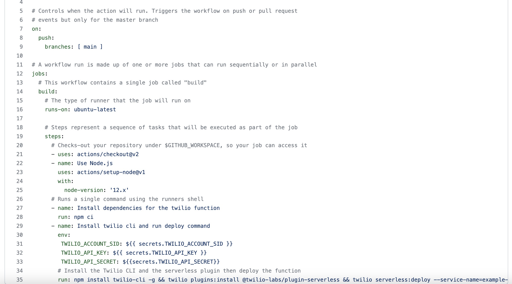
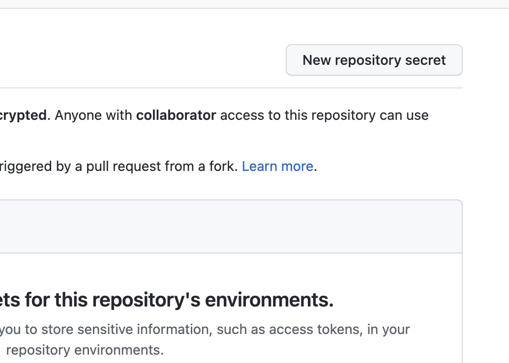
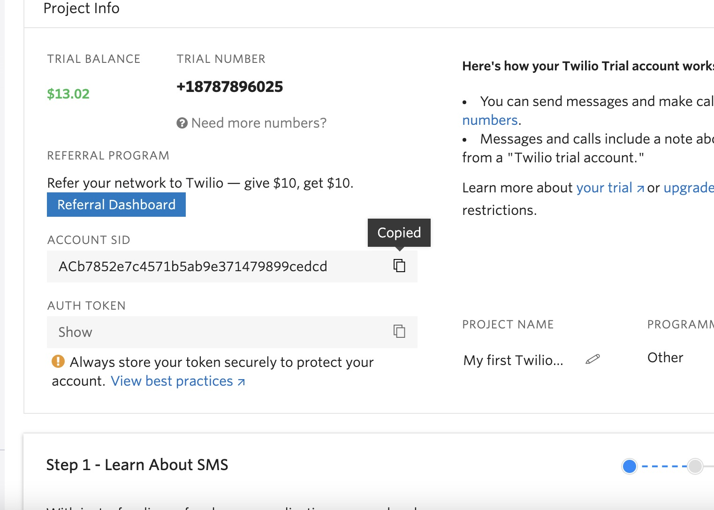
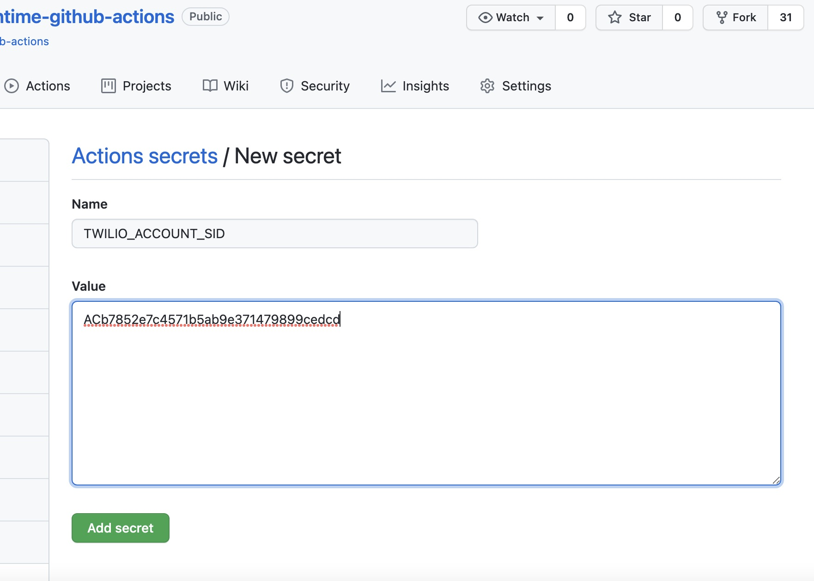
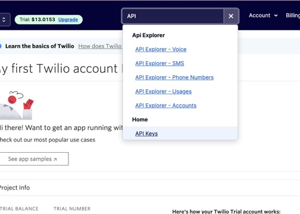
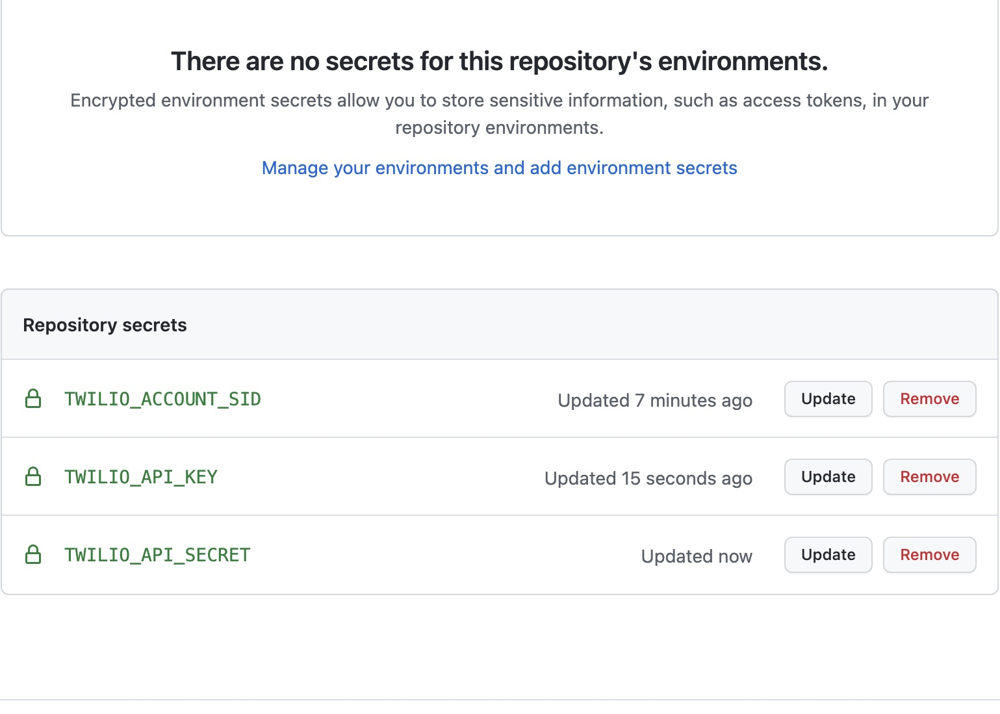
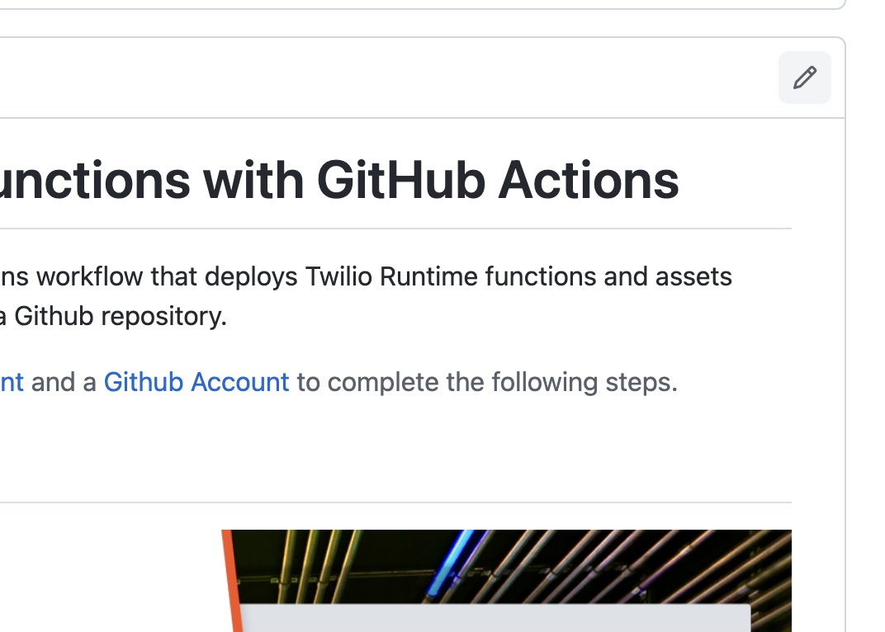
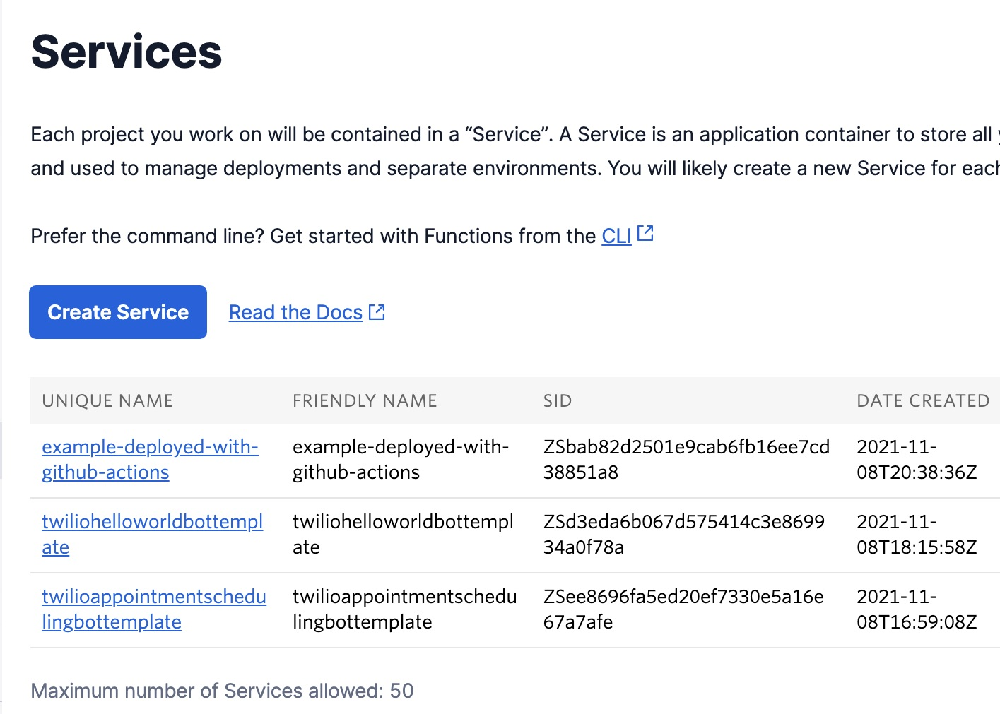
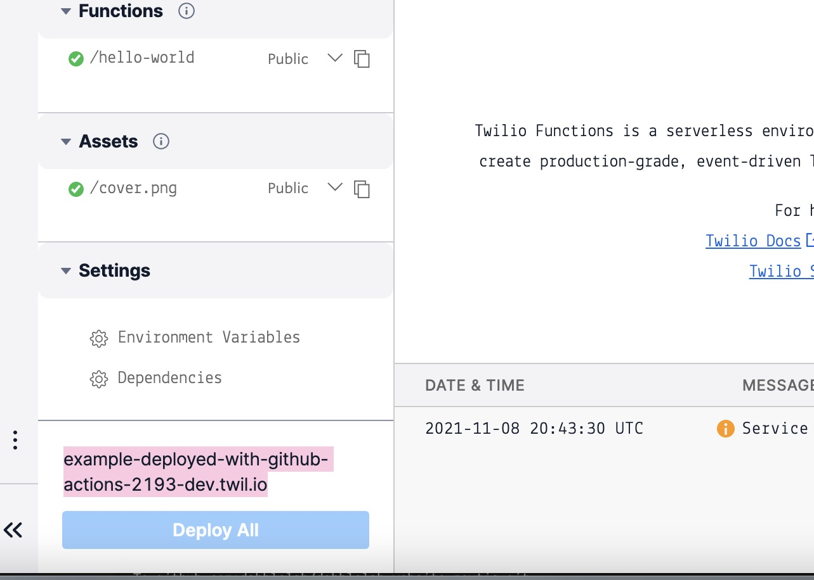
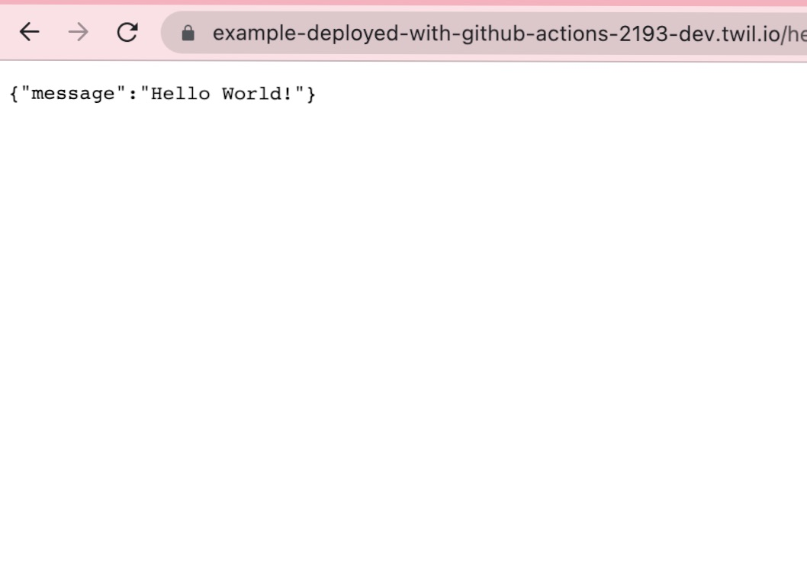

# CI/CD for Twilio Functions with GitHub Actions

### Today were going to learn how to automatically deploy Twilio Runtime Functions and Assets when new code updates are pushed to a GitHub repository.

Prerequisites: Please ensure you create a Twilio account, install the Twilio CLI, and create a Github account.

- [Get Started with Twilio](https://www.twilio.com/try-twilio)
- [The Twilio CLI Quick Start Guide](https://www.twilio.com/docs/twilio-cli/quickstart)
- [Get Started with Github](https://github.com/)

After creating both Twilio and Github accounts, and ensuring you are set up with the Twilio CLI, navigate [here](https://github.com/dabblelab/twilio-runtime-github-actions)

Click on the fork button in the top right corner, and select your account. Now, click on the actions tab click the green button that says "I understand my workflows, go ahead and enable them.

Click on the code tab, and enter the directory .github/workflows. Open the main.yml file, and take a look around. This file determines what actions a workflow will take. Notice at the bottom, there are a few environmental variables that will need to be filled out.

 

Navigate to your repository's settings tab, and then on the left sidebar menu, select secrets. Click on the button in the top right corner to create a new repository secret. Head to the console.twilio.com main page, scroll down and copy your account SID

Return to Github and create a new secret called TWILIO_ACCOUNT_SID, paste your account SID value in as the body.

Now, return to the twilio console, and type API into the search bar, select API Keys.

Click create API key, give it a name, keep it standard and create. Copy your secret and keep it in a safe place you'll be able to find it if needed. Return to github, and create a new secret called TWILIO_API_KEY, paste the value from your Twilio API key called SID as the body. Create another new secret called TWILIO_API_SECRET, and paste the value from your Twilio API key called secret as the body.

Now head to the code tab of your repository, click the pencil in the top right corner of your readme, and once the editor opens, make a small change to the existing readme, and commit the changes.

Head to your repository's actions tab, and see the build action taking place. Once it has completed, head to your Twilio console, search for functions and select functions fron the menu, then select services from the left sidebar menu. There you will see your example app deployed as example-deployed-with-github-actions!

If you open your newly created function within Twilio, you will see a URL in the bottom left corner,

Paste this into your browser and add /hello-world to see the magic happen!

