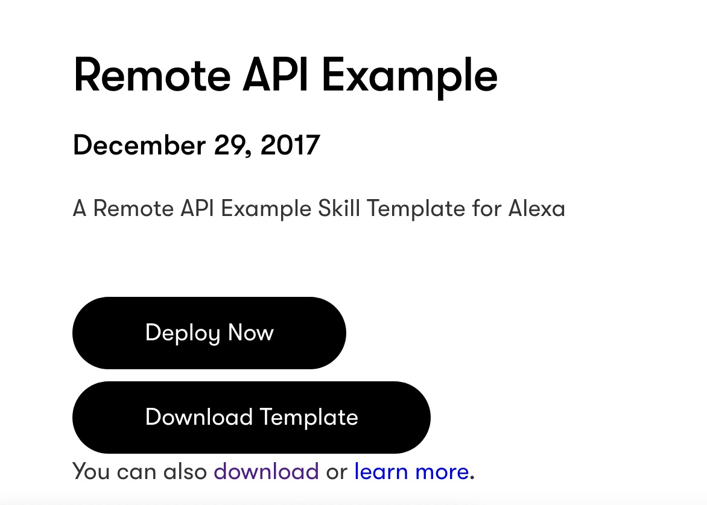
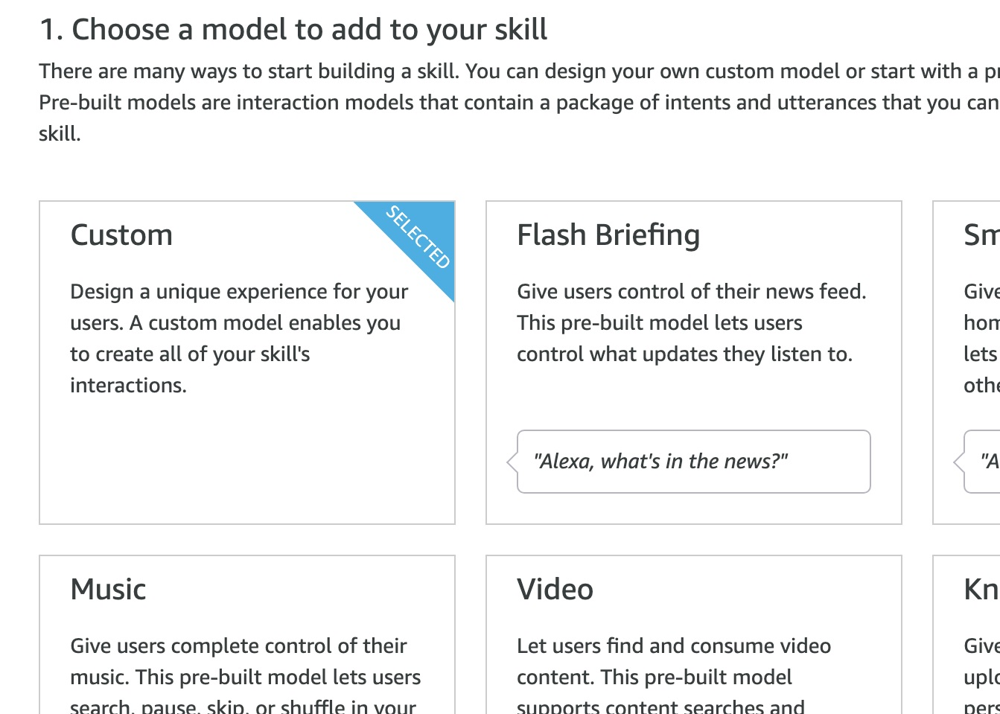
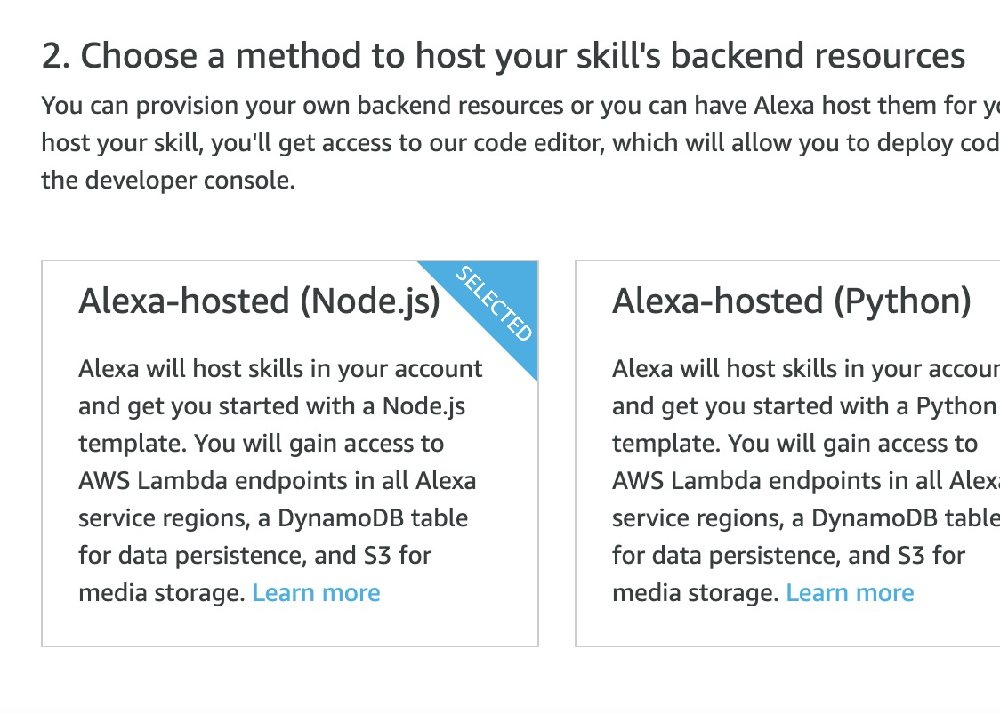
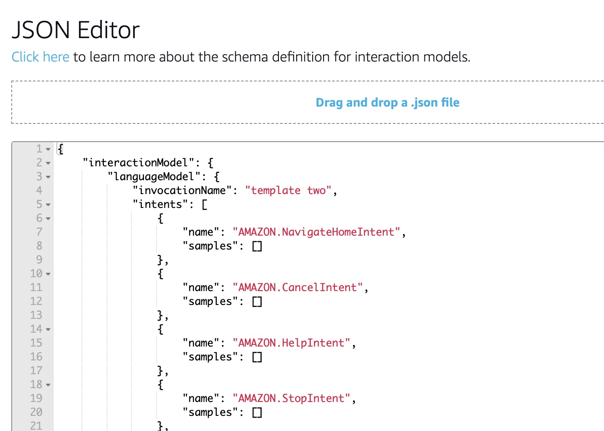
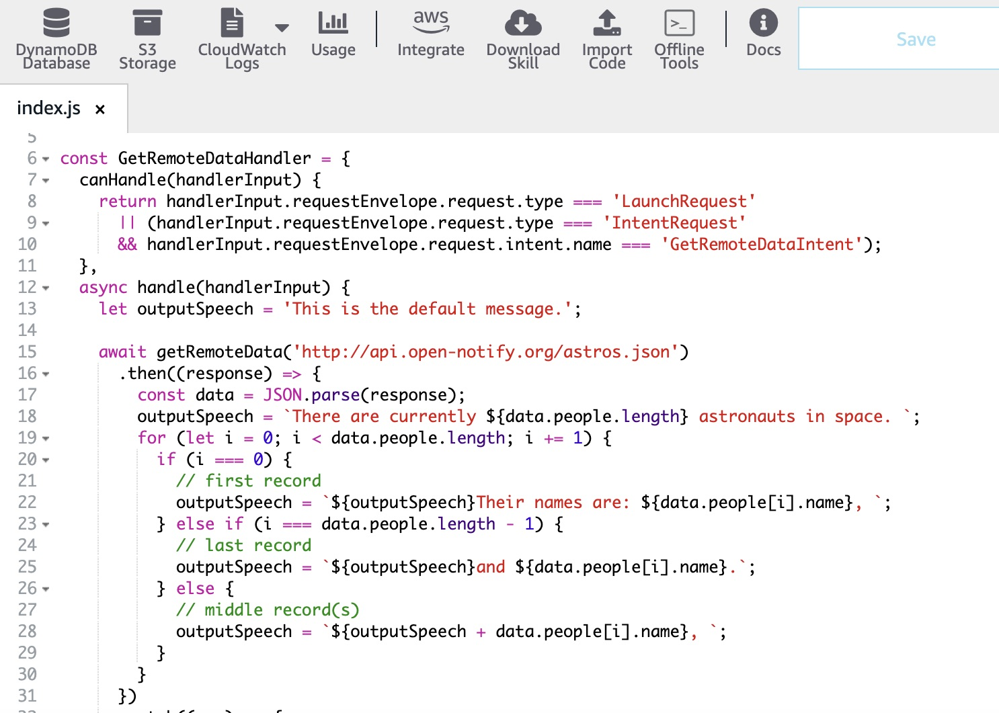
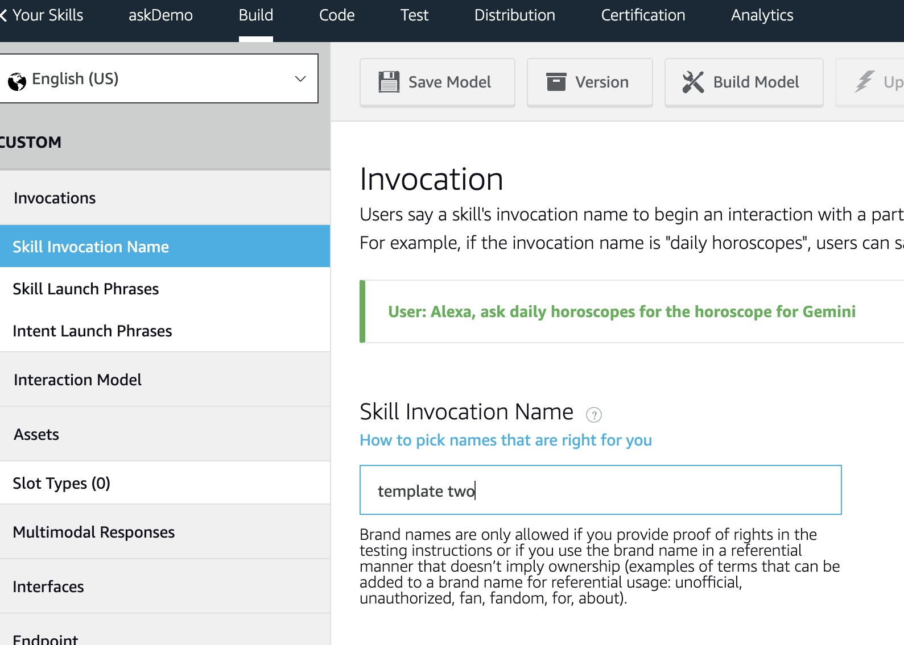
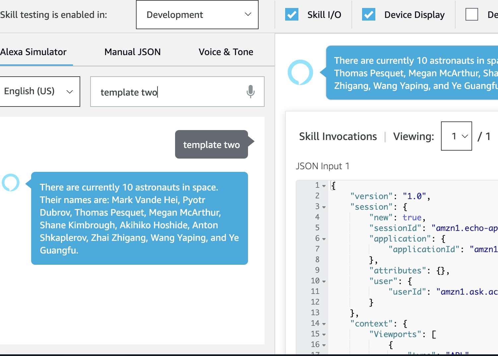

Today were going to use the ASK CLI to build an Alexa skill that uses data from an external API.

## Prerequisites
Please ensure you have set up free tier AWS and Amazon developer accounts, which can be found below, and configure ASK CLI settings. 

- [Create an AWS FREE TIER account.](https://aws.amazon.com/) Card details will be required, but there is a free tier.
- [Create an Amazon Developer account.](https://developer.amazon.com/)
- [Configure ASK CLI using this tutorial](/posts/askClI-setup-tutorial)

Open your browser to dabblelab.com, and navigate to the templates tab. Click on the template called Remote API Example. Sign up for a free account. Once you have done so, return to the Remote API Example template page and click on Dowload Template.

Navigate to your downloads folder, and open unzip the template zip file. Open it within the text editor of your choice. 

Now, head to amazon.developer.com, select the alexa tab, and from the dropdown menu in the top right corner, select Alexa Developer Console. Now, click create new skill. 

Give your skill the desired name, under Choose a model to add to your skill, select custom, and under choose a method to host your skill's backend resources, select Alexa-hosted (Node.js). Scroll up and click create skill, then select start from scratch.

Now, head back the developer console and look under the interaction model tab and select the JSON editor.

Head back to your downloaded template and under the models directory open the file called en-US.json. Copy it's contents. Return to the amazon developer console JSON editors, delete it's contents and replace them with the JSON copied from the en-US.JSON file. Click save model, and then build model.

Return to your template file within your text editor, head to lamba/custom/index.js and copy it's contents. Return now to the developer console and select the code tab from the navigation bar. Replace the contents of the index.js file at this location with the copied code from your template. Select save, and then deploy.

Be sure to take note of the await getRemoteData function on line 15, this is where an address to an API can be passed in to return the data of your choice.

Click on the build tab of the navigation bar, go to invocations, and click on Skill invocation name. Take note of the name of your Skill invocation which is sourced automatically from your input JSON file.

Now select the test tab from the navigation menu, enable skill testing in development, and type your Skill invocation name into the input, press enter, and hear/see the magic happen!

